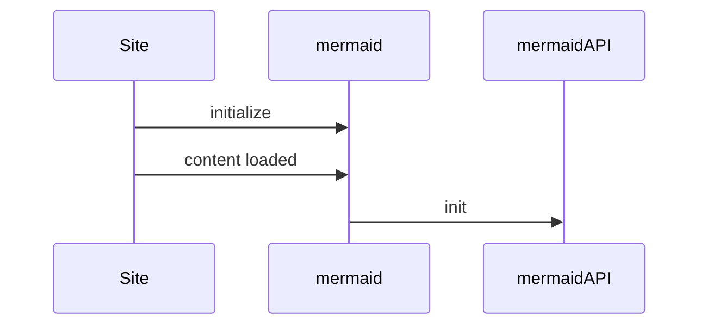

# Configuration

When mermaid starts, configuration is extracted to determine a configuration to be used for a diagram. There are 3 sources for configuration:

- The default configuration
- Overrides at the site level are set by the initialize call, and will be applied to all diagrams in the site/app. The term for this is the **siteConfig**.
- Directives - diagram authors can update select configuration parameters directly in the diagram code via directives. These are applied to the render config.

**The render config** is configuration that is used when rendering by applying these configurations.

## Theme configuration

## Starting mermaid

## Initialize

The initialize call is applied **only once**. It is called by the site integrator in order to override the default configuration at a site level.

## configApi.reset

This method resets the configuration for a diagram to the overall site configuration, which is the configuration provided by the site integrator. Before each rendering of a diagram, reset is called at the very beginning.
graph TD
    A[STM32微控制器]
    B[DHT11/DHT22传感器]
    C[LCD显示屏]
    D[按键模块]
    E[电源模块]
    F[外部存储器(可选)]
    G[通信模块(可选)]

    A --> B
    A --> C
    A --> D
    A --> E
    A --> F
    A --> G

    subgraph 软件部分
    H[系统初始化]
    I[传感器数据采集]
    J[显示数据处理]
    K[按键处理]
    L[数据存储(可选)]
    M[远程通信(可选)]

    H --> I
    I --> J
    J --> K
    K --> L
    L --> M
    end
